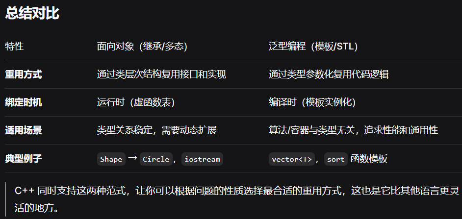
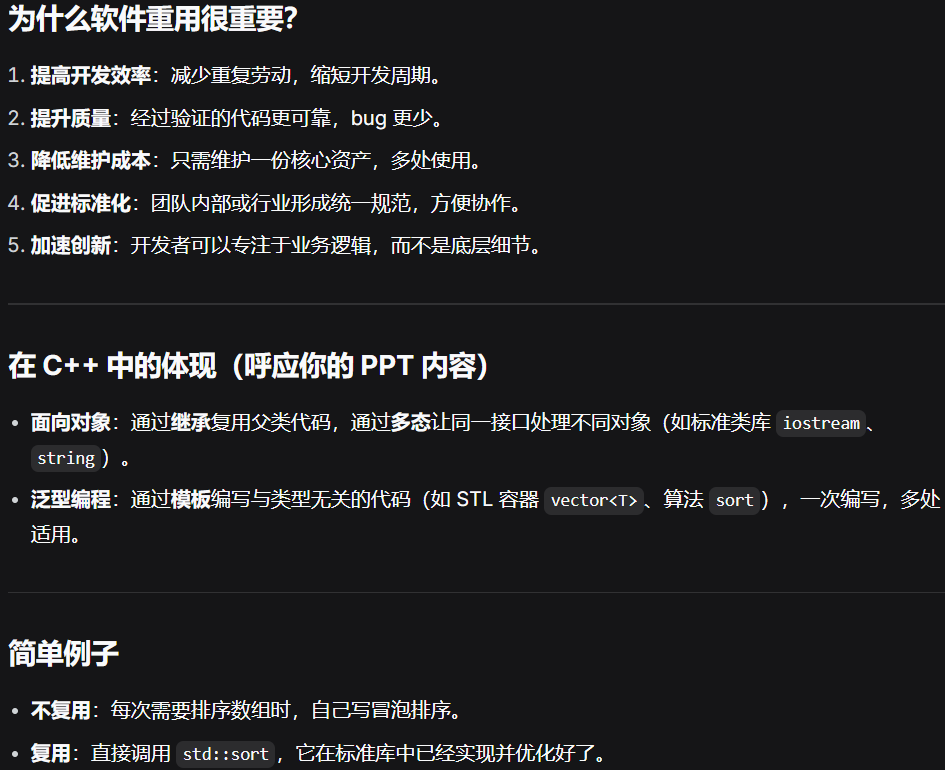

STL的基本介绍：
C++ 语言的核心优势之一就是便于软件的重用
软件重用（Software Reuse）是指在软件开发过程中————
————使用已有的软件资产（如代码、设计、文档、测试用例等）来构建新的软件系统，而不是从头开始编写所有内容。
核心思想：
不重复造轮子：把已经开发好的、经过测试的、可靠的组件或模块再次用于其他项目。
资产化：将代码、框架、库、设计模式、架构等视为可复用的“资产”，集中管理并供多个项目共享。
软件重用就是“站在巨人的肩膀上”开发软件。
它不是简单复制粘贴，而是通过系统化的方式（库、框架、组件、服务）把已有的优秀成果用于新项目，从而更高效、更可靠地构建软件。

C++ 中有两个方面体现重用：
	1.面向对象的思想：继承和多态，标准类库
	2.泛型程序设计(generic programming) 的思想： 模板机制，以及标准模板库 STL
详解如下：  

泛型程序设计：
简单地说就是使用模板的程序设计法。
将一些常用的数据结构（比如链表，数组，二叉树）和算法（比如排序，查找）写成模板，
以后则不论数据结构里放的是什么对象，算法针对什么样的对象，则都不必重新实现数据结构，重新编写算法。
标准模板库 (Standard Template Library) 就是一些常用数据结构和算法的模板的集合。
有了STL，不必再写大多的标准数据结构和算法，并且可获得非常高的性能。

STL中的基本的概念：
容器：可容纳各种数据类型的通用数据结构,是类模板
迭代器：可用于依次存取容器中元素，类似于指针
算法：用来操作容器中的元素的函数模板
	sort()来对一个vector中的数据进行排序
	find()来搜索一个list中的对象
	算法本身与他们操作的数据的类型无关，因此他们可以在从简单数组到高度复杂容器的任何数据结构上使用。（模板化的效果）
对于【容器+迭代器+算法】的举例说明：sort函数排序数组
int array[100];
该数组就是容器，而 int * 类型的指针变量就可以作为迭代器，sort算法可以作用于该容器上，对其进行排序：
sort(array,array+70); //将前70个元素排序