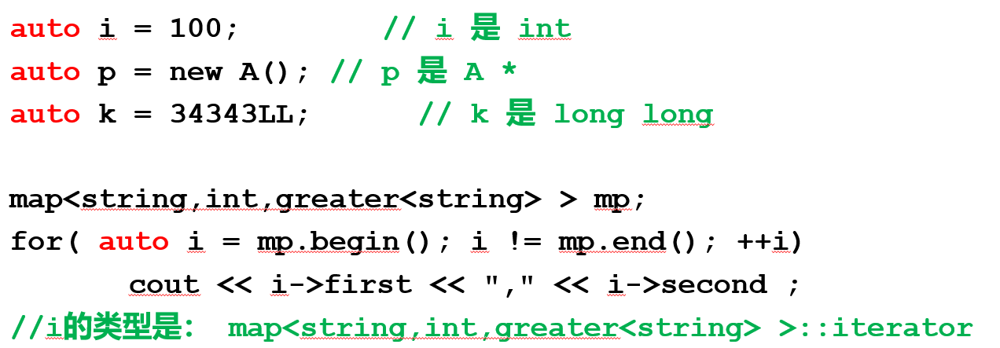
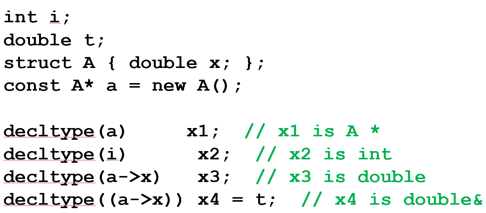
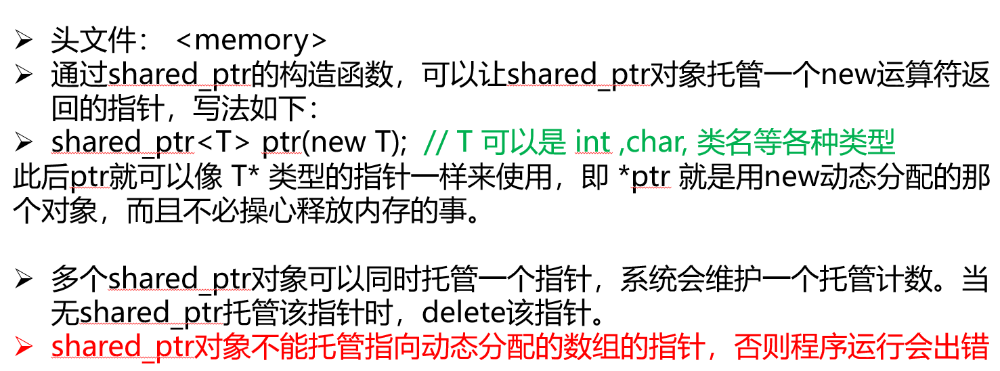

auto关键字：用于定义变量，编译起可以自动判断变量的类型————用例：
decltype 关键字：求表达式的类型————用例：
decltype(i) 直接当成 int 来用
智能指针shared_ptr：头文件<memory>达成————用例：
空指针nullptr：也要用<memory>，比NULL更加安全
基于范围的for循环：
int ary[] = {1,2,3,4,5};
for(int & e: ary) / for(auto & e: ary)    

move相关命令？？
右值引用与move语义：move 是一个类型转换函数（定义在 <utility> 中），它只是将左值强制转换为右值引用，本身不做任何资源转移。
真正的资源转移发生在移动构造函数或移动赋值运算符中。
**右值通常与移动构造函数搭配联合使用**

1.左值右值：
右值：一般来说，不能取地址的表达式，就是右值，能取地址的，就是左值
class A { };
A & r = A(); // error , A()是无名变量，是右值
A && r = A(); //ok, r 是右值引用

2.函数返回值为对象时，返回值对象如何初始化？
只写复制构造函数
    return 局部对象   -> 复制
    return 全局对象   ->复制
只写移动构造函数
    return 局部对象   -> 移动
    return 全局对象   ->默认复制
    return move(全局对向） -〉移动
同时写 复制构造函数和 移动构造函数:
    return 局部对象   -> 移动
    return 全局对象   -> 复制
    return move(全局对向） -〉移动

3.移动构造函数：源头被清空的复制行动
移动构造函数是 C++11 引入的，它接受一个右值引用参数（如 T::T(T&& other)），将 other 的资源“转移”到新构造的对象中，而不是复制。
转移后，源对象通常被置于“有效但未指定”的状态（例如指针置空、长度置零），析构它不会影响新对象。