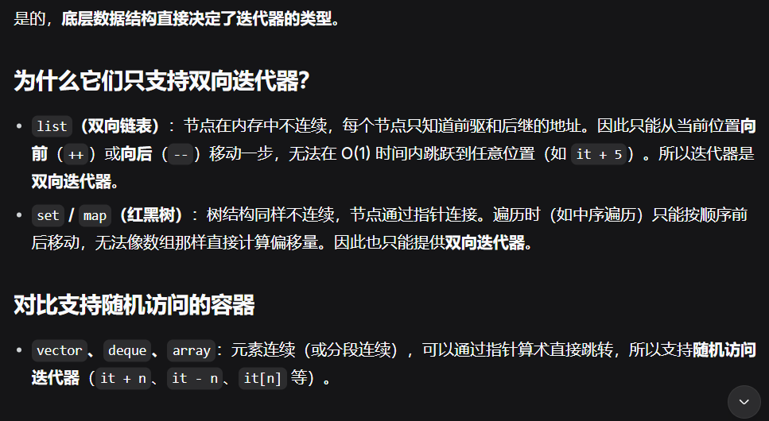

迭代器：用于指向顺序容器和关联容器中的元素（queue，stack不可用，是容器适配器）
迭代器用法和指针类似，有const 和非 const两种，通过迭代器可以读取它指向的元素，通过非const迭代器还能修改其指向的元素
总结：迭代器是对指针概念的泛化和安全封装，使用方式与指针高度相似，但支持更多数据结构。

迭代器基本操作：定义与访问：
定义一个容器类的迭代器的方法可以是：容器类名::iterator   变量名;
或：容器类名::const_iterator 变量名;
访问一个迭代器指向的元素：* 迭代器变量名（类似指针解引用提取指向的值）
迭代器上可以执行 ++ 操作, 以使其指向容器中的下一个元素。（类似指针的++操作）
如果迭代器到达了容器中的最后一个元素的后面，此时再使用它，就会出错，类似于使用NULL或未初始化的指针一样。

迭代器类型：双向迭代器（受限）和随机访问迭代器：**底层数据结构直接决定了迭代器的类型**
双向迭代器：list，set，map（受制于数据结构所以不能太自由操作）：
若p和p1都是双向迭代器，则可对p、p1可进行以下操作：
++p, p++  	        使p指向容器中下一个元素
--p, p-- 	        使p指向容器中上一个元素
* p  		        取p指向的元素
p = p1		        赋值 
p == p1 , p!= p1	判断是否相等、不等
随机访问迭代器：vector，deque（支持更多自由操作）：
除了双向迭代器的所有操作之外，还支持以下操作：
p += i              将p向后移动i个元素
p -= i              将p向向前移动i个元素
p + i               值为: 指向 p 后面的第i个元素的迭代器
p - i               值为: 指向 p 前面的第i个元素的迭代器
p[i]	            值为: p后面的第i个元素的引用
p < p1, p <= p1,    比大小
p > p1, p >= p1     比大小
p – p1              p1和p之间的元素个数
Hint**有的算法，例如sort，需要通过随机访问迭代器来访问容器中的元素，那么list以及关联容器就不支持该算法！**

