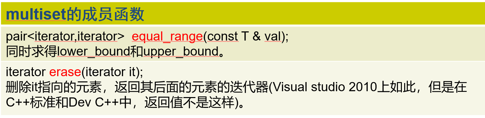

set/multiset基本介绍：
内部元素有序排列，新元素插入的位置取决于它的值，查找速度快。

**set元素保证唯一，multiset允许重复元素，这是二者的唯一区别**

除了容器共有的函数外，multiset还有以下函数：
find: 查找等于某个值 的元素(x小于y和y小于x同时不成立即为相等)————返回iterator
lower_bound : 查找某个下界————返回iterator
upper_bound : 查找某个上界————返回iterator
equal_range : 同时查找上界和下界————返回iterator
count :计算等于某个值的元素个数(x小于y和y小于x同时不成立即为相等)————返回int
insert: 用以插入一个元素或一个区间————void类型

**辨析————set的insert函数返回值是 std::pair<iterator, bool>**
对于 std::set，**单参数**版本的 insert 成员函数返回值是 std::pair<iterator, bool>。
iterator 指向被插入的元素（若插入成功）或已存在的等值元素（若插入失败）。
bool 表示插入是否成功：true 表示成功插入新元素，false 表示集合中已存在相同键值的元素，此时不会修改集合。
而 std::multiset 的 insert 返回的是单纯的 iterator（因为允许重复，总是成功插入）。

multiset独有的函数：

set/multiset：可自定义“谁比谁小”的规则
template<class Key, class Pred = less<Key>, class A = allocator<Key> >
Pred类型的变量决定了multiset 中的元素，“一个比另一个小”是怎么定义的。
multiset运行过程中，比较两个元素x,y的大小的做法，就是生成一个 Pred类型的变量，假定为 op,若表达式op(x,y) 返回值为true,则 x比y小。
自定义结构体或者类来比大小就是用对()运算符的重载来完成的
Pred的缺省类型是 less<Key>。也就是从小到大的排列

用less模板的定义来深化这一个理解：
less 模板的定义：是靠 < 来比较大小的，所以需要按情况重载 < 运算符
**但如果不用less而用其他()的重载来比较大小，则不见得会用上 < 运算符，适当重载即可**
template<class T> 
struct less : public binary_function<T, T, bool> 
{ bool operator()(const T& x, const T& y) { return x < y ; } const;   };  