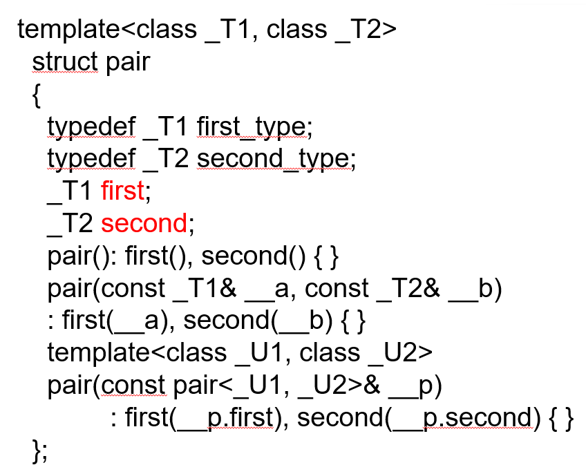

map/multimap里放着的都是pair模版类的对象，且按first从小到大排序
pair模板如下：

multimap：template<class Key, class T, class Pred = less<Key>, class A = allocator<T> > 
multimap中的元素由 <关键字,值>组成，每个元素是一个pair对象，关键字就是first成员变量,其类型是Key
multimap中允许多个元素的关键字相同。而map的键值对是唯一的
元素按照**first成员变量**从小到大排列，缺省情况下用 less<Key> 定义关键字的“小于”关系，其他时候可以由Pred自由加工。
注意Pred中重载()之后,(x,y)返回true那么x就要排在y的前面，使用less<Key>来记忆

map的[ ]成员函数————由于键值对唯一，才可以通过键来唯一地访问对应的值key
若pairs为map模版类的对象,pairs[key] 
返回对关键字等于key的元素的值(second成员变量)的引用。
若没有关键字为key的元素，则会往pairs里插入一个关键字为key的元素，其值用无参构造函数初始化，并返回其值的引用.
