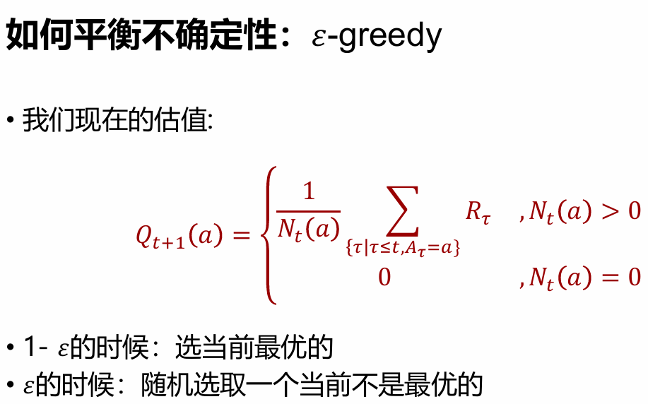
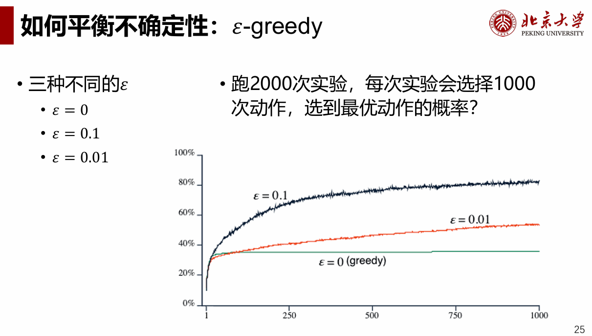
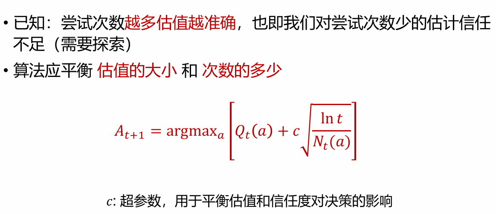
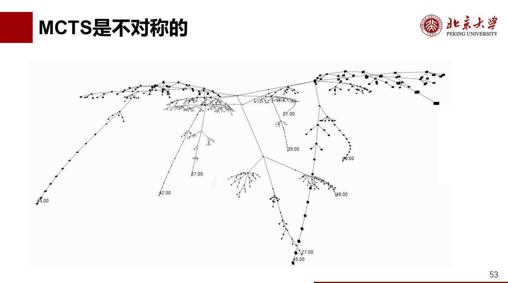
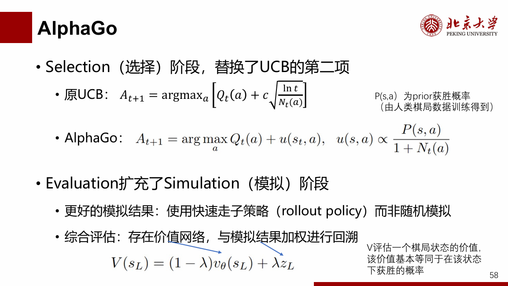
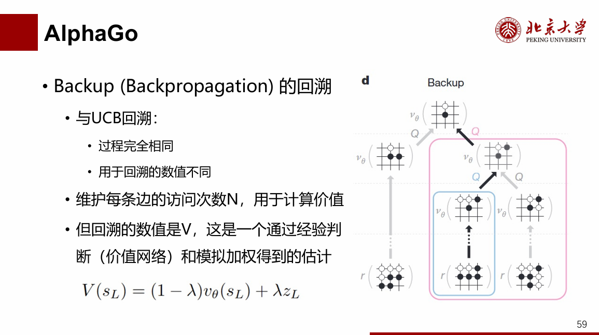
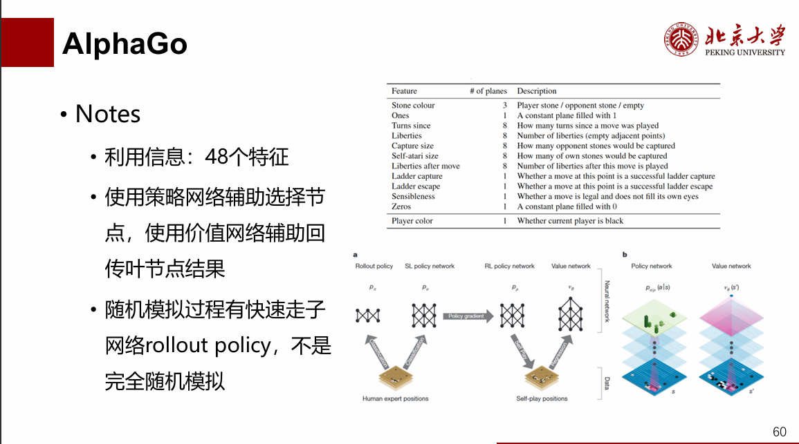
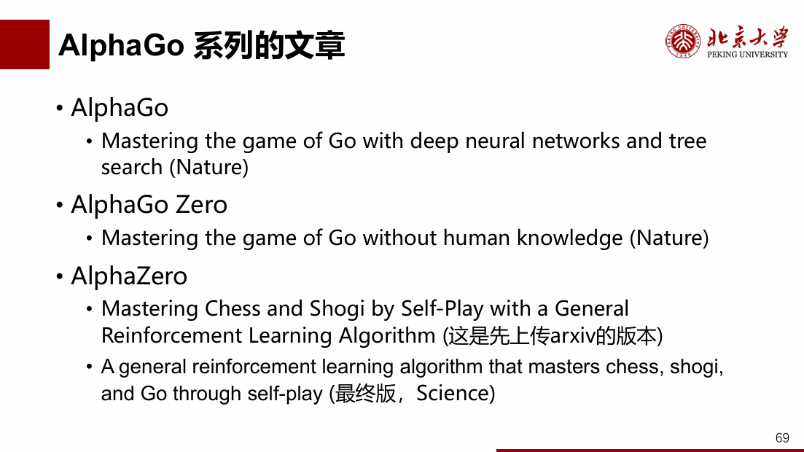

蒙特卡洛树搜索方法：大量随机搜索树模拟的试验方法
例子：正方形内大量撒点估计圆周率大小：次数越多越准确，估计的准确度与样本方差有关
如何平衡期望的不确定性？数学语言formulate如下：
• 𝑘：动作的数量（比如，有多少老虎机）
• 𝑞∗ 𝑎：动作𝑎的真实价值
• 𝑄𝑡(𝑎)：在时间𝑡 的时候，对动作𝑎的估值
• 𝑁𝑡(𝑎)：在时间𝑡 及之前，动作𝑎被选中的次数
• 𝑅𝑡：在时间𝑡得到的价值
• 𝐴𝑡：在时间𝑡采取的动作
两种策略之一：利用（exploitation），选取现在最优的
两种策略之二：探索（exploration），选取现在非最优的

矛盾点：既想抓住最优的玩下去，又怕自己判断错
如何平衡不确定性：𝜀-greedy，图片解释如下：

𝜀-greedy————设定概率为ε，1- 𝜀的时候：选当前最优的；𝜀的时候：随机选取一个当前不是最优的
也就是将极端理性的贪心搜索加上概率微调优化，效果如下：

进一步优化ε-greedy如下：
效果：探索是永远需要的，因为我们的估计永远有不确定性
问题： ε-greedy强制非最优动作也会被尝试，但对所有非最优动作一视同仁
解决： 如果我们可以更多地去尝试那些更有希望成为更优的动作，算法的效率将更高
最大置信：公式推导需要借助【大数定律】

上图公式右侧表示探索次数Nt少的节点要去多探索！！！其中c就是去探索次数少的节点的“引导参数”

得到思路总结如下：从UCB到博弈（单次动作到序列动作）
1：构建向前看的博弈树
2：通过随机模拟，来产生节点的估值函数
3：在博弈树的中间节点，根据UCB来选择动作
重复循环————选择-扩展-模拟-回溯
• 根节点：我方面临的情形
• 根节点扩展出的路径：我方的不同选择
• 按照深度不同，立场是交替的
• 即：假设对手也会选择较优的策略

循环中每一步的含义与作用：
1.选择：UCB单次判断
每个步骤中都采取UCB，已经运行了大量模拟来积累所显示的统计信息，注意对手与自己的立场转换
2.扩展：遇到根节点之后的树结构延展：
当沿着选择的路径选择节点，没有被探索过时，需要扩展。（如果探索过，则需要继续选择————选择到根节点之后再扩展）
扩展方式有两种：
  （1）.单子节点扩展：每次扩展一个新的子节点（常用）
  （2）.全子节点扩展：一次性扩展所有可能的子节点，记录0/0（初始化新开出来的节点，准备模拟）
3.模拟：进行根节点棋局
新记录添加后，蒙特卡洛模拟开始，如虚线箭头所示。模拟中的动作可能完全是随机的，也可能使用计算来加权随机性
注意，在实际使用MCTS的时候，模拟经常不会选择一直运行到博弈结束。而是会设置一个最大步数，然后直接返回启发值。（类似一定深度的MiniMax）
4.回溯：
在模拟结束后，所采取路径上的所有记录都会被更新
每个相关节点的次数都会加1，如果最后获胜了每个相关节点都会将胜利次数加1
随着【选择->扩展->模拟->回溯】过程的循环进行，节点越来越多，形成蒙特卡洛搜索树！

MCTS是不对称的搜索树，如图：

AlphaGo对于MCTS的全面改进：流程图与一般MCTS基本一致，但树的伸展过程极大优化！

此外还有两点循环外的优化：
1.问题1：用蒙特卡洛方法随机产生的估值不适用，对手并不会真的随机下
  改进1：利用真实人类历史对战的数据，学习更好的估值
2.问题2：如果利用历史人类数据进行估值，那上限最多是人类水平
  改进2：RL阶段：使用自我对弈的数据继续学习

从AlphaGo到AlphaZero：
1.无需人类监督，自我对弈进化
2.48特征通道-> 仅棋盘黑白子————简化输入特征，减少了对领域知识的依赖
3.统一神经网络，策略网络和价值网络架构合二为一，模拟阶段也直接使用这个网络进行决策
4.离散更新参数，每次保留最好的版本用于作为自我对弈的对手

总结：
• 如何估值？
• 蒙特卡洛方法
• 如何从数据中学到更好的估值-> 机器学习（周四见！）

• 如何平衡不确定性？
• 置信上界（UpperConfidence Bound）
• UCB两个term，Q和sqrt（ln(t)/N），一个反映现在的估值，一个反映我们的确信度，平衡两者

• 蒙特卡洛搜索
• select（利用UCB）、expand、simulate、back-propagate

AlphaGo参考论文：
