机器学习基础和线性回归
Core Problem————什么是学习？？

传统编程：数据+程序——>计算机——>结果
机器学习：【数据+结果】成对——>计算机——>模型
机器学习例子：
搜索引擎、垃圾邮件分类、推荐系统、人脸识别、机器翻译、交通预测、语音识别、自动驾驶（长尾效应数据处理？？）、蛋白质结构预测

机器学习的数学模型分类：
1.判别式模型：给出正误判断（监督学习：有人为标注）
2.描述式模型：给出描述性的函数特征（非监督学习）
3.生成式模型：基于一系列数据进行目标生成（非监督学习）
又：强化学习————自主探索，仅给出reward来驱动学习

从基础开始：判别式模型&监督学习
模型：一个包含参数的函数    标签：要预测的类别和数值
模型训练（机器学习）：调整模型参数，拟合训练数据
分类Classification：标签是离散值，要得到聚类结果，各结果平级（猫狗品种分类、手写数字识别）
回归Regression：标签是连续值，要得到函数结果，函数值有高低（房价预测、股价预测）

TRICK————*用分类的方式解回归的问题？？
将连续的回归目标值“离散化”成多个类别，然后用分类模型去预测“属于哪个区间”，最后再从类别预测结果反推出连续的数值。
简单说：回归预测一个具体数字，分类预测这个数字落在哪个“格子”里。
得到离散分类后再加权平均反推连续值，例子如下：
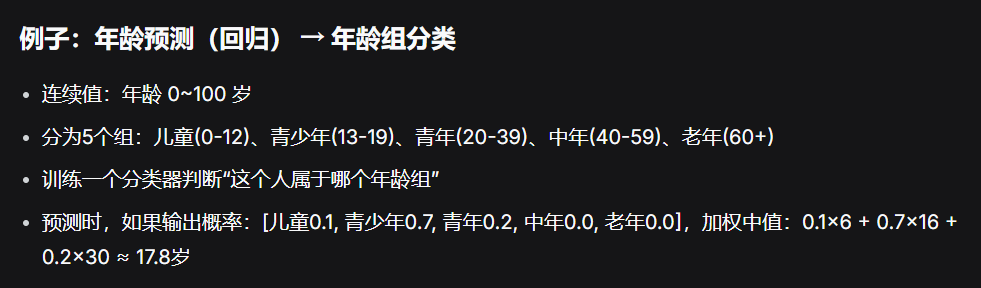
总结
“用分类的方式解回归” = 将连续输出离散化成多个有序类别 → 训练分类模型 → 将预测的概率分布重新聚合成连续值。
这是一种实用的工程技巧，尤其适合目标值分布复杂、你需要不确定性估计的场景。
它不是万能的，但当你的回归问题可以接受一定程度的“区间预测”时，它往往能带来更好的效果和鲁棒性。

分类机器学习一例：垃圾邮件识别
利用词频向量：标记各个单词的出现次数【例如识别诈骗邮件就标记金钱相关的词语】

模型评估：
1.训练误差：在训练集上的平均误差，通过最小化训练误差来训练模型（例：分类问题的错误率）
2.测试误差：在测试集上的平均误差，衡量模型的泛化能力，避免过拟合！！！！！！！
3.过拟合：测试误差远远大于训练误差————错把训练集的局限性feature当作普适性规律
4.欠拟合：在训练集上都确有问题！！
————从欠拟合到过拟合，训练集误差单调递减，测试集误差U型曲线先减后增，如图：
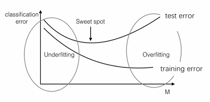
PS：在深度学习情况下又和这个图不一样，模型够大的深度学习大模型会随着scaling up从而两条曲线的误差都下降

机器学习k近邻算法：
对于一个测试样本，用训练样本中距离它最近的k个样本中占多数的标签来预测测试样本，如图：
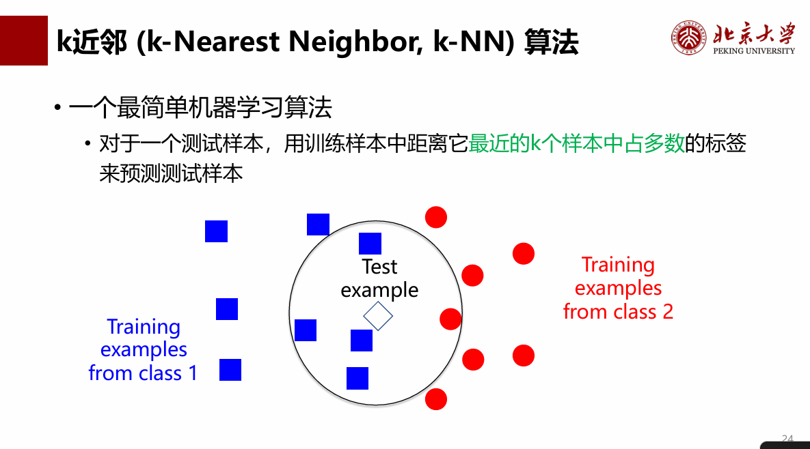
优点：不用训练，只需要训练集+一个距离函数来判断新的点该是什么品类
缺点：存储所有样本、比较用时过长、距离函数不好寻找与定义，例如欧氏距离在缩放中失效————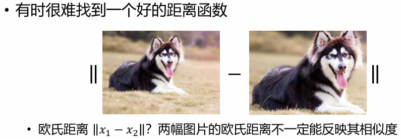
缺点：维数灾难————距离在高维空间失去意义，不再能很好地衡量远近，k-NN不适合高维空间，而实际情况维数都很高！！
维数灾难：对于随机分布的高维正方体，就算所需体积很少，但是边长仍然会趋近于1，因为次方太大了————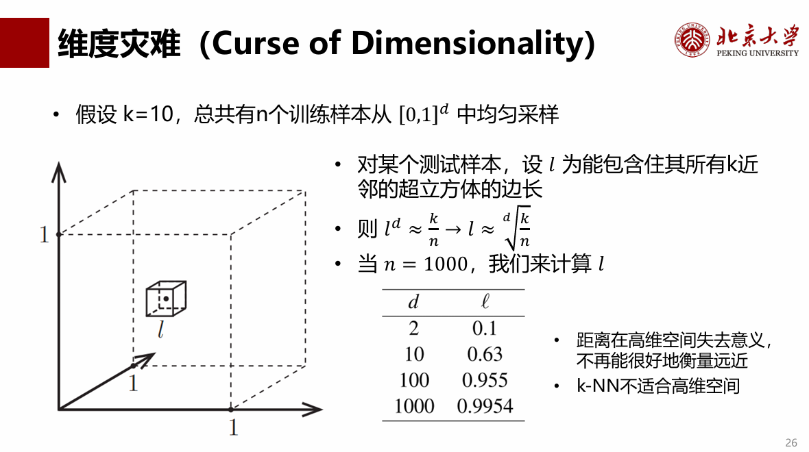

k近邻的局限本质————模型不含参数，无法主观调整优化，只能被动依赖于训练集给出结果
从非参数化模型到参数化模型————例如线性回归&神经网络
1.模型包含可训练的参数，通过拟合训练数据来估算模型参数
2.训练好模型参数后，可以丢弃训练数据，仅依靠模型参数去预测新样本

最简单的参数化模型————线性模型与线性回归————f(x) = wTx + b————一维二维三维：就是w和x的向量维度…………
！！！涉及线代与numpy！！！这里的wT是向量转置存储参数，x是输入的向量，用内积表示得出的结果f(x)
b————作为偏置————一些一致性的基础预测值
线性回归训练方法：平方损失函数 (squared loss)————通过在训练集上最小化平均损失函数来优化参数𝑤,b
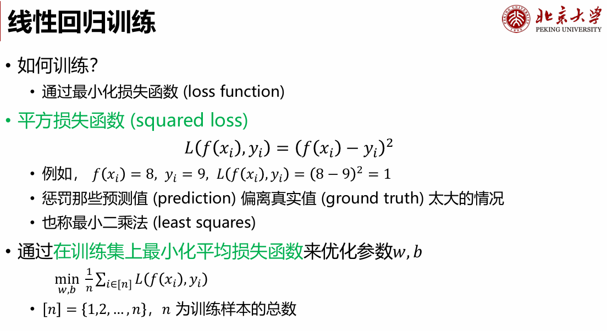

如何最优化？？梯度下降！！仔细研究PPT如下：
凸函数：在任何一个点都能画一个平面/二次函数将曲线托起来（凸的性质越来越好）
这是凸优化最迷人的特性。经过合法操作后，任何你找到的局部极小值都是全局极小值。这意味着算法的结果不依赖于糟糕的初始猜测。
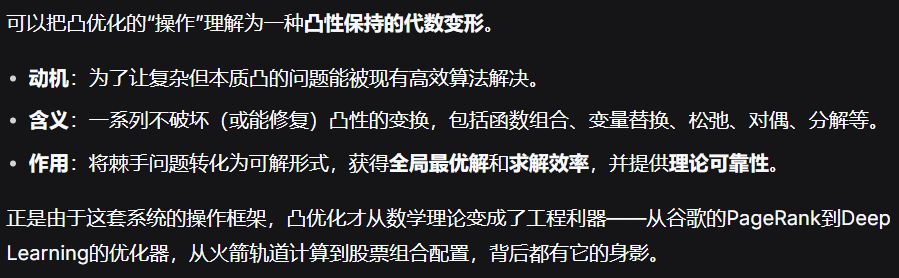
注意凸函数凸优化思维（凸函数保证局部最优就是全局最优）、超参数“学习率”的引入：梯度下降的进行速率【太高太低都不好，需要调参处理】
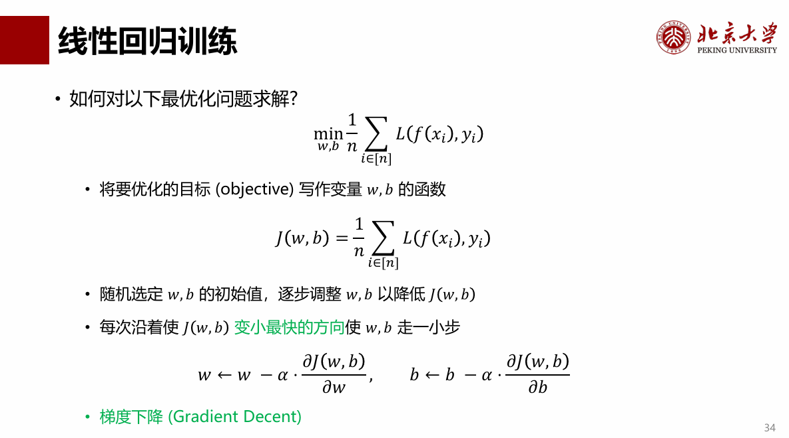————“对w求导”的解释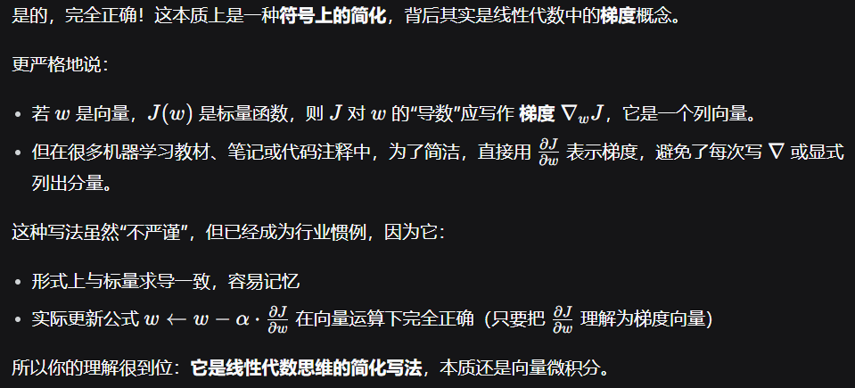
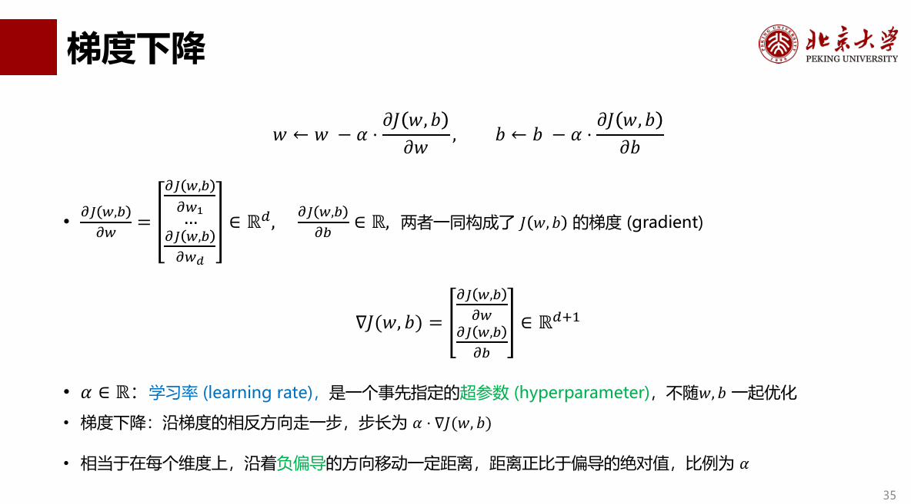
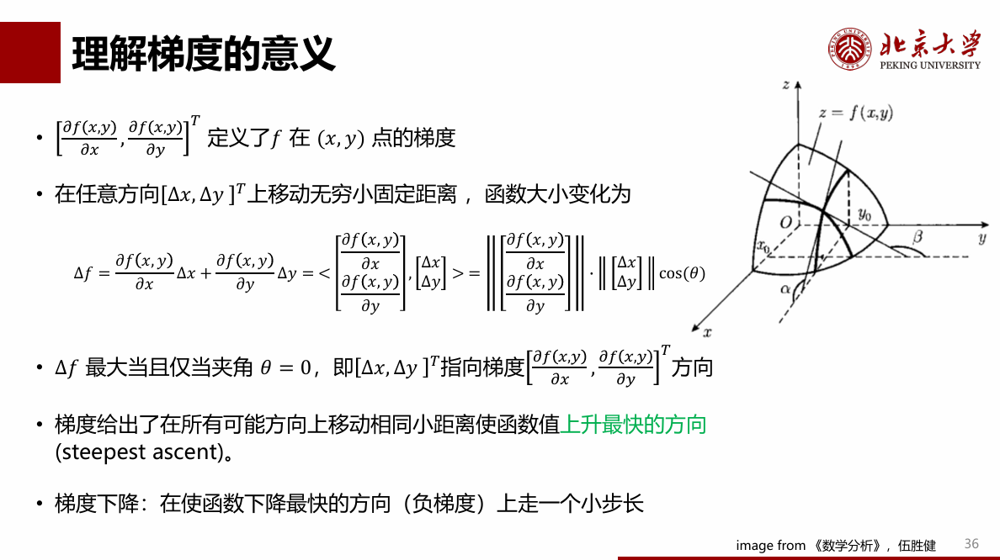
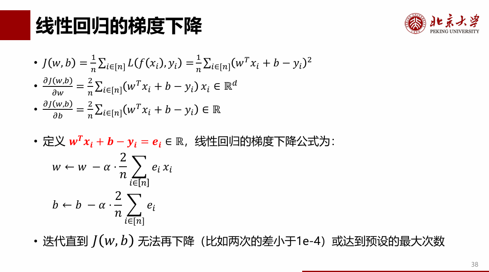
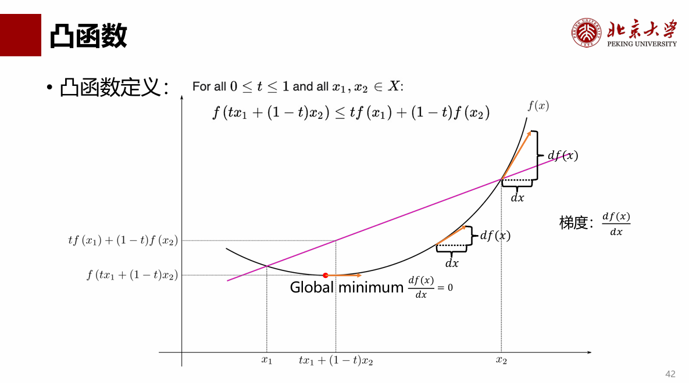
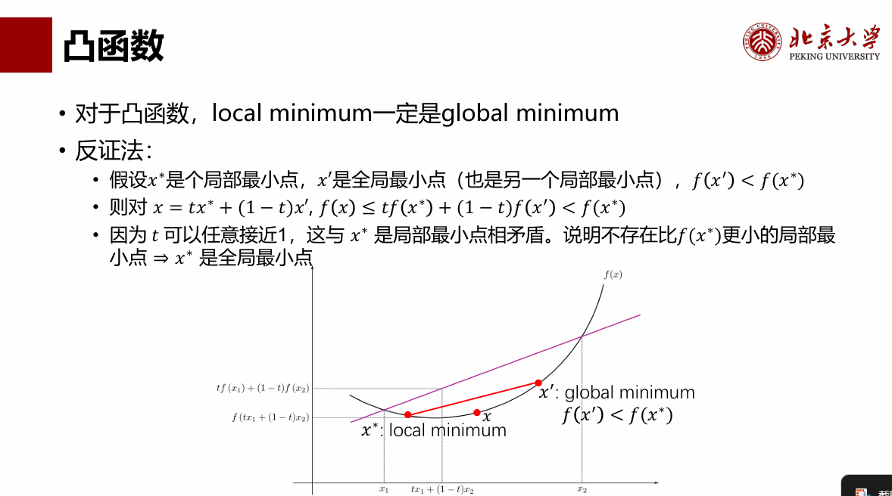
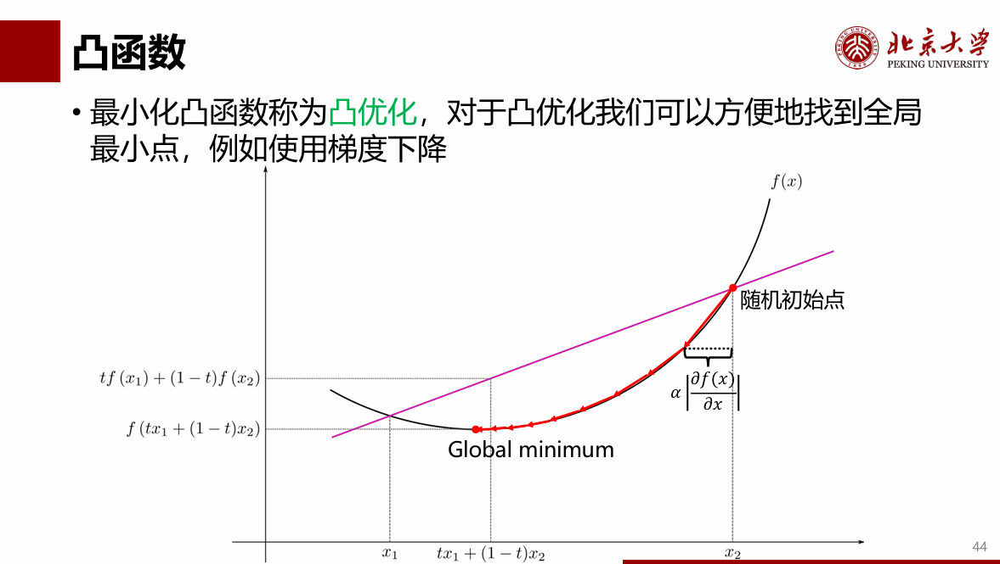————凸优化操作复杂，最终效用是可以进行梯度下降直逼最优的收敛点！
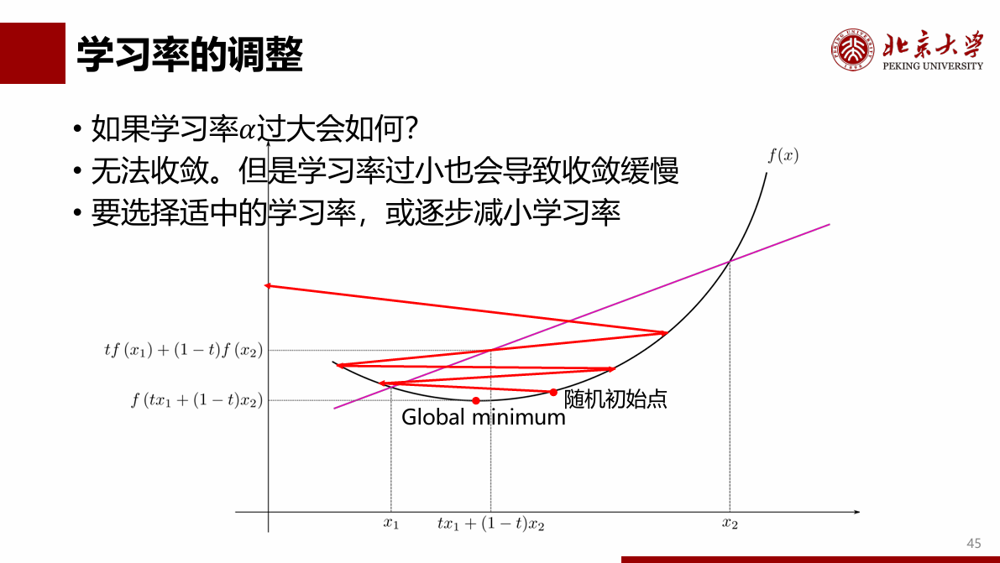————学习率α这个超参数需要调参处理
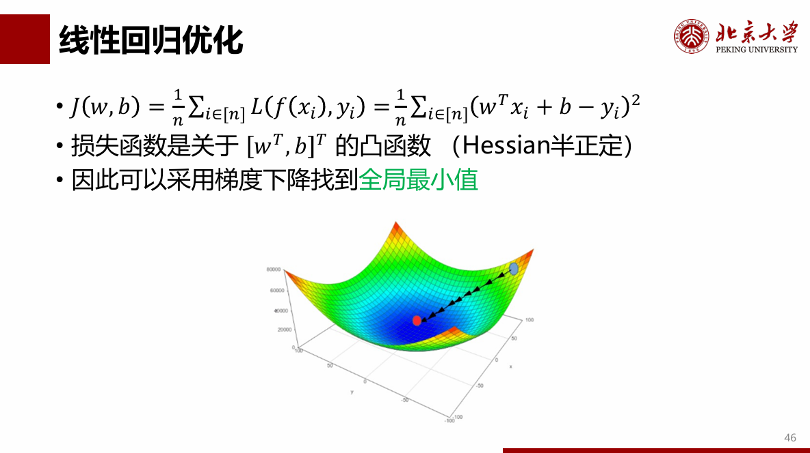————线性回归是凸函数可证明，线代过程略繁杂————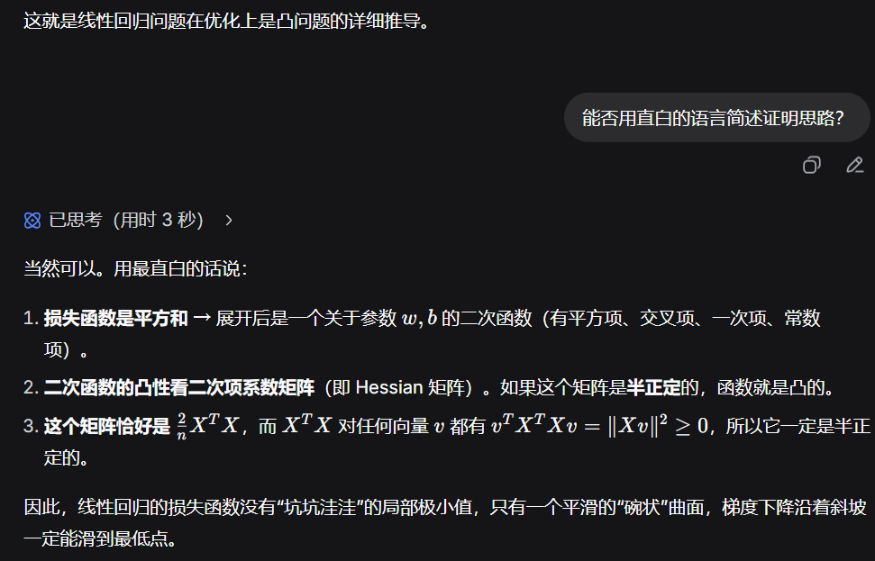
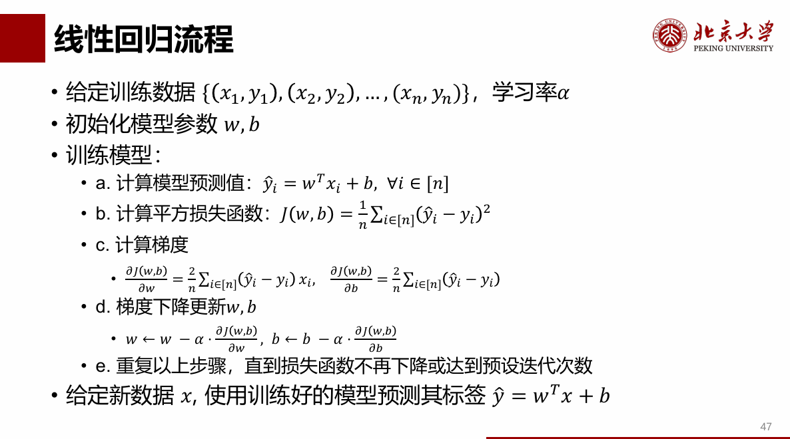————总线性回归流程，注意熟悉线代表征方式以及梯度求导法则

总结：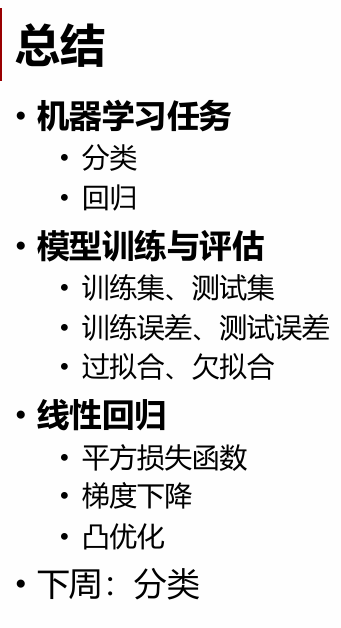